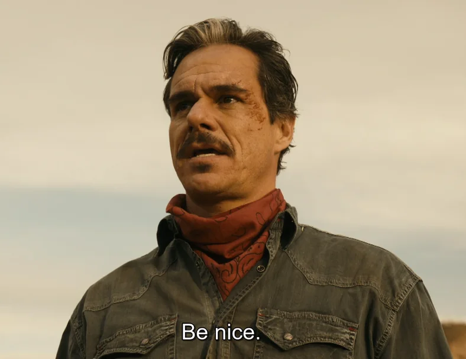

# Code of Conduct

 

Be nice, be kind, be respectful, assume good intent. That's all.

Constructive criticism is welcome. Personal attacks, harassment, and disrespectful behavior are not.

If something feels off, reach out at [amitvaibhavtiwari@gmail.com](mailto:amitvaibhavtiwari@gmail.com) and it'll be handled.